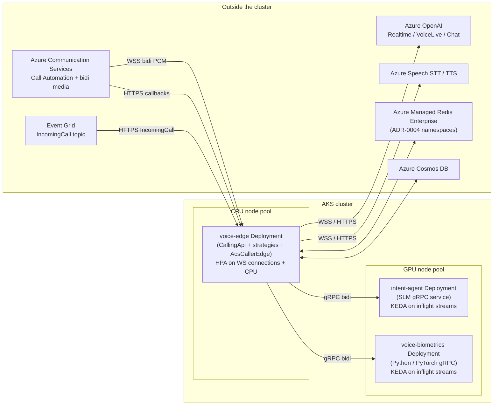
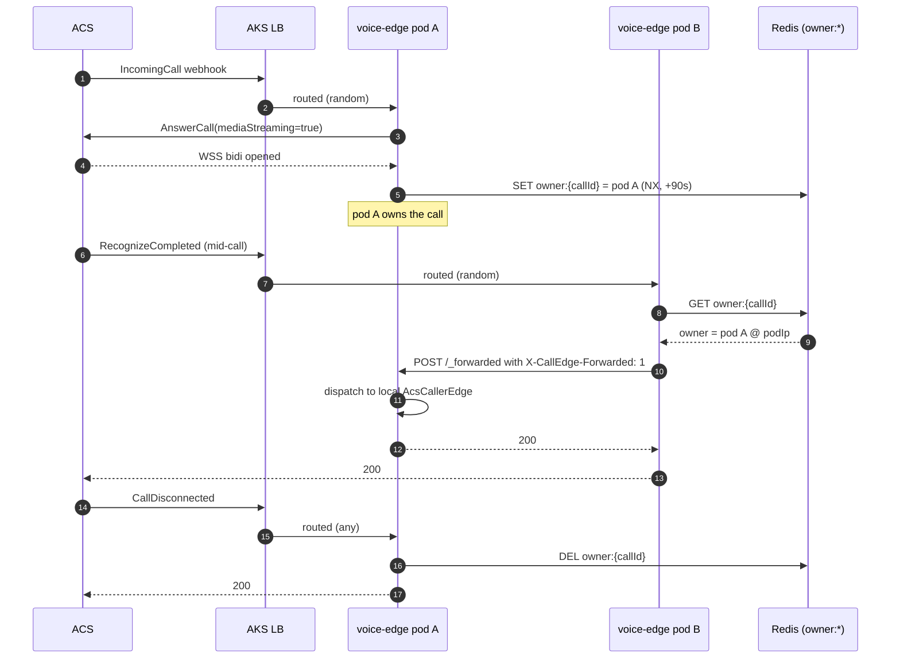

# AKS topology — deployment view for the ContactCenter platform

- **Status:** Living document (showcase build, design flexes to hyperscale)
- **Last revised:** 2026-05-22
- **Audience:** Platform engineers provisioning the AKS cluster(s) and the SRE on call when something pages

This document is the **deployment view** of the platform. It says where each process lives, how they talk, which node pool runs which workload, and how the same code scales from a 10-call showcase to a 50-300k-concurrent-call production posture. The *why* behind each decision lives in the ADRs — this doc cross-references them rather than repeating them.

## Why a separate deployment-view doc

The ADRs answer "what call control plane do we use?" ([ADR-0002](../adr/0002-acs-call-automation-as-control-plane.md)), "how does state survive a pod restart?" ([ADR-0004](../adr/0004-call-state-in-redis-by-callconnectionid.md)), "how do we degrade when the realtime AI provider gets throttled?" ([ADR-0008](../adr/0008-graceful-degradation-realtime-to-dtmf.md)). None of them answer "given those decisions, how many Deployments do I actually have, what's in each one, and what does the Helm chart need to look like?" That's what this doc is for.

## The three Deployments

The showcase platform runs **three** Deployments across **two** node pools. Managed dependencies (ACS, Azure OpenAI, Azure Speech, Cosmos, Redis) sit outside the cluster.

| Deployment | Node pool | Demo replicas | Routing | What it owns | Inbound protocols |
|---|---|---|---|---|---|
| `voice-edge` | CPU | 2 | LB (HTTPS + WSS); hybrid sticky-WS via `owner:{callConnectionId}` Redis lookup | `CallingApi`, all `IConversationStrategyFactory` instances (Realtime / NLU / DTMF), composite tier fallback, `AcsCallerEdge` + `AcsCallAutomationEdge`, `AuthorizingAgentRealtimeBackend`, in-process PCM channels | HTTPS (Event Grid + ACS callbacks), WSS (ACS bidi media) |
| `intent-agent` | GPU-small | 1 | ClusterIP; KEDA on inflight streams | SLM-based intent classifier for Tier 2/3 fallback (Phi-4-mini class) | gRPC (`Classify(stream Utterance) → stream IntentScore`) |
| `voice-biometrics` | GPU-small | 1 | ClusterIP; KEDA on inflight streams | SpeechBrain/PyTorch speaker verification ([ADR-0009](../adr/0009-voice-biometrics-stub-vs-grpc.md)) | gRPC (existing `biometrics.proto`) |

## Why the call-edge stays monolithic

Everything that **produces or consumes caller audio** — the realtime backend, the NLU strategy and its STT, the DTMF strategy and its TTS, the `AcsCallerEdge` PCM frame pump — lives inside `voice-edge` and exchanges audio frames through `System.Threading.Channels` and `System.IO.Pipelines`. Crossing a pod boundary for audio framing would add at least one mTLS-on-HTTP/2 hop per 20 ms frame, which is measurable against the ≤800 ms first-token budget called out in [ADR-0006](../adr/0006-realtime-ai-voicelive-vs-gpt-realtime.md).

Two things justify out-of-process today and only two:

1. **Python / PyTorch (voice-biometrics).** Different language, GPU required, request/response or short stream. The biometrics evaluator's per-call latency is already measured in hundreds of milliseconds for the model inference itself; one extra gRPC hop is in the noise.
2. **SLM intent classifier (intent-agent).** GPU required, separate scaling axis from the call-edge (intent calls happen at most a few times per call, not 50 times per second), large model weights you don't want sitting in voice-edge's working set.

Everything else — STT, TTS, Realtime AI — is a **managed Azure service** consumed over HTTPS/WSS from voice-edge. The cluster doesn't host them. That keeps the pod boundary count to the bare minimum the runtime actually demands.

## In-process vs gRPC — the decision matrix

| Call-path boundary | Choice | Why |
|---|---|---|
| `CallingApi` ↔ `ICallSession` ↔ strategies | In-process | Audio hot path; channels stay in-pod; no marshalling overhead |
| Strategy ↔ Azure OpenAI Realtime / VoiceLive | WSS (managed) | Existing `AuthorizingAgentRealtimeBackend` decorator; one stateful WS per call |
| Strategy ↔ Azure Speech STT/TTS | HTTPS / WebSocket (managed) | Existing `AzureSpeechSynthesizer`; per-utterance |
| `voice-edge` ↔ `intent-agent` (Tier 2/3 SLM) | **gRPC bidi stream** | GPU pod; separate scaling axis; transcript chunks are tolerant of a single intra-cluster hop |
| `voice-edge` ↔ `voice-biometrics` | **gRPC bidi stream** | GPU pod; Python; `biometrics.proto` already defined |
| `voice-edge` ↔ `voice-edge` (webhook forward to WS-owning pod) | Internal HTTP/2 (showcase) → gRPC service (production) | Same Deployment, ClusterIP service `voice-edge-internal`; mTLS via service mesh in production |
| Anything ↔ Cosmos / Redis | SDK | Persistence and coordination, not hot path |

## Hybrid sticky-WS + stateless-webhook routing

ACS bidi media is anchored to the pod that accepts the WebSocket — that's a physics constraint, not a design choice. ACS mid-call webhooks (`RecognizeCompleted`, `PlayCompleted`, `CallTransferAccepted`, `CallDisconnected`, …) and Event Grid `IncomingCall` are HTTP and can land on any pod. The two semantics have to be reconciled at the AKS load-balancer layer.

The chosen reconciliation (per [ADR-0011](../adr/0011-pod-ownership-and-lease-model.md)) is:

1. **Pod A** answers an `IncomingCall` and accepts the bidi WS. It writes `owner:{callConnectionId} = {clusterId, podId, podIp, instanceId, kind=streaming, leaseUntil=+90s}` to Redis using `SET … NX` ([ADR-0004](../adr/0004-call-state-in-redis-by-callconnectionid.md) `owner:*` namespace).
2. The local `CallOwnershipLeaseRenewer` hosted service renews `leaseUntil` every 30 s for every locally-owned call.
3. When a mid-call callback for that `callConnectionId` lands on **pod B** (load balancer picked it), pod B looks up `owner:{callConnectionId}`:
   - **Owner is pod B itself** — dispatch in-process to the local `AcsCallAutomationEdge` / `AcsCallerEdge` and return 200.
   - **Owner is pod A** — pod B POSTs the raw CloudEvent array to `http://{owner.podIp}:80/calling/automation/callbacks/_forwarded/{serverCallId}` with `X-CallEdge-Forwarded: 1`. The forwarded route on pod A skips the ownership lookup (header-gated) and dispatches locally. Single-hop guard: a request that already carries the header is dropped with telemetry.
   - **Owner is unknown / lease expired** — pod B returns 200 and logs. ADR-0011's reaper picks up the orphan within 90 s.
4. On `CallDisconnected`, whoever owns the call locally calls `ReleaseAsync` which `DEL owner:{callConnectionId}`.

The showcase build implements this with `ICallOwnershipRegistry` (Redis or in-memory) and `ICallEventForwarder` (HTTP/2) in `Agents.AI.ContactCenter.Calling.Routing`. The reaper (`IPodHeartbeat`) is deferred — see [Future work](#future-work).

### Why HTTP and not gRPC for the intra-edge forwarder

Forwards are a **small fraction** of total callback traffic ([ADR-0011](../adr/0011-pod-ownership-and-lease-model.md)) — only mid-call events for streaming-mode calls that didn't land on the WS-owning pod, after dedup. The forwarded payload is the original `CloudEvent[]` byte body verbatim. HTTP keeps the forwarder a single-file Polly-wrapped `HttpClient`; gRPC would require a wrapper proto for `CloudEvent`. The doc-level upgrade path is: when the service mesh is in (Linkerd or Istio), switch the forwarder to a small gRPC service contract so mTLS, retries, and observability come for free.

## Node pool layout

Two AKS node pools, sized for the demo, with the scaling shape described in the next section.

| Pool | VM family (showcase / hyperscale) | Workloads | Tolerations / taints | Notes |
|---|---|---|---|---|
| `cpu` | D8s_v5 / D16s_v5 | `voice-edge` | (none) | Default pool; system pods land here too. Autoscale on pod scheduling pressure. |
| `gpu-small` | NC4as_T4_v3 / NC8as_T4_v3 | `intent-agent`, `voice-biometrics` | `nvidia.com/gpu=present:NoSchedule` | One GPU per pod; SpeechBrain and Phi-4-mini both fit on a T4. KEDA scales on inflight gRPC streams. |

If the realtime AI provider ever moves in-house (self-hosted realtime model), add a third `gpu-large` pool (A100/H100) — but the call-edge does not need to live with it, because the realtime model would expose a WSS endpoint that voice-edge consumes the same way it consumes Azure OpenAI today.

## Scaling matrix

The codebase already defines per-tier `MaxConcurrent` budgets in `AgentTierOptions` (RealtimeVoice 50k, ChatCompletionTts 150k, SmallLanguageModel 200k, IntentNlu ∞, DtmfOnly ∞). The deployment translates those budgets into replica counts.

| Scenario | Concurrent calls | `voice-edge` replicas | `intent-agent` replicas | `voice-biometrics` replicas | Redis | Topology |
|---|---|---|---|---|---|---|
| **Showcase** | ~10 | 2 | 1 | 1 (or stub) | Standard, single-region | Single AKS cluster, AppHost defaults |
| **Pilot** | ~40k | ~40 (HPA: 1k WS per pod target) | ~6 | ~8 | Enterprise, single region | Single AKS cluster; KEDA on Redis `cap:tier:*` for admission; PDB minAvailable=`replicas-1` |
| **Hyperscale** | ~300k | ~320 across **2 active-active clusters** ([ADR-0010](../adr/0010-active-active-multi-cluster-topology.md)) | ~40 per cluster | ~60 per cluster | **Enterprise + active geo-replication** | Per [ADR-0010](../adr/0010-active-active-multi-cluster-topology.md); per-cluster ceilings per [ADR-0008](../adr/0008-graceful-degradation-realtime-to-dtmf.md); reaper per [ADR-0011](../adr/0011-pod-ownership-and-lease-model.md) |

### Sizing heuristics

- **`voice-edge` per-pod ceiling**: target ~1k concurrent WS per pod for streaming-mode calls (D8s_v5 has 8 vCPU; realtime backend is bound by network I/O on the audio path, not CPU). Verb-mode (Tier 3/4) pods could carry 5k+ each but the same Deployment serves both — size to the lower bound.
- **`intent-agent` per-pod ceiling**: SLM inference on T4 is ~30 ms p50 for a Phi-4-mini class model, with ~50 concurrent inferences before queueing kicks in. ~6 replicas absorb 40k calls' worth of fallback intent traffic (assumes degradation cap to ~10 % of calls hitting Tier 2/3 in steady state, per [ADR-0008](../adr/0008-graceful-degradation-realtime-to-dtmf.md)).
- **`voice-biometrics` per-pod ceiling**: SpeechBrain ECAPA-TDNN on T4 is ~200 ms per verification. ~8 replicas absorb 40k calls each doing a single verification at answer time.
- **HPA inputs**: `voice-edge` scales on `pod_websockets_active` (custom metric scraped from `MeterName=Calling.Edge`) and CPU. `intent-agent` and `voice-biometrics` scale on `grpc_server_handled_total` rate and inflight streams via KEDA's gRPC scaler.
- **PDBs**: `voice-edge` `minAvailable=replicas-1` so node upgrades drain one pod at a time and only verb-mode calls migrate; streaming-mode calls re-establish on a new pod via ACS's WS reconnect.

## Why ACS Container Apps today, AKS-shaped tomorrow

The current `Showcase.AppHost/Program.cs` wires both `voice-edge` and the GPU services to Aspire-managed **Azure Container Apps** environments (`acaEnvironment` and `acaGpuEnvironment`). ACA is AKS-shaped without managing the cluster — same container model, same scale-to-zero semantics, same ingress shape. The same `Showcase.AppHost` graph can publish to a real AKS cluster via Aspire's Kubernetes publisher (`azd up` with the Kubernetes manifest publisher) when the pilot / hyperscale tiers demand the operational control AKS gives.

The conversion mapping is direct:

| ACA concept (AppHost) | AKS equivalent |
|---|---|
| `AddProject<T>("voice-edge").WithComputeEnvironment(acaEnvironment)` | `Deployment + Service` on the `cpu` node pool |
| `WithComputeEnvironment(acaGpuEnvironment)` | `Deployment` with `nodeSelector` + GPU toleration on the `gpu-small` pool |
| `.WithExternalHttpEndpoints()` | `Service type=LoadBalancer` + AKS application routing add-on (or `Ingress` with cert-manager) |
| `WithReference(intentAgent)` injecting `ConnectionStrings__intentagent` | `Service` DNS name (`intent-agent.contactcenter.svc.cluster.local`) wired into the same env var |
| ACA managed identity → Cosmos/KV | AKS Workload Identity → same |
| ACA Dapr / service mesh hooks | Linkerd or Istio sidecars |

We don't ship raw Kubernetes YAML in this iteration — the AppHost graph is the source of truth and Aspire generates manifests at publish time. The shape above is for operators planning the AKS posture.

## How the topology maps to the existing ADRs

| ADR | What it decides | How this doc consumes it |
|---|---|---|
| [ADR-0001](../adr/0001-pstn-ingress-via-tpe.md) | PSTN → Teams RA → ACS via TPE | Ingress is to ACS, not to AKS directly. The AKS surface is webhooks + bidi WS only. |
| [ADR-0002](../adr/0002-acs-call-automation-as-control-plane.md) | ACS is the call-control plane; AKS app is just HTTPS | Justifies `voice-edge` as a stateless HTTP service with no SIP stack. |
| [ADR-0003](../adr/0003-incomingcall-delivery-via-event-grid.md) | Event Grid webhook with synchronous validation | `voice-edge`'s `/calling/automation/incoming` route handles both validation and `IncomingCall`. |
| [ADR-0004](../adr/0004-call-state-in-redis-by-callconnectionid.md) | Redis namespaces (`state:`, `dedup:`, `owner:`, `cap:tier:`, `ceiling:cluster:`) | `RedisCallOwnershipRegistry` writes the `owner:*` namespace per this contract; future work writes the others. |
| [ADR-0006](../adr/0006-realtime-ai-voicelive-vs-gpt-realtime.md) | Realtime AI provider choice (open) | `voice-edge` consumes whichever provider wins via the existing `liveConversationClientKey: "voicelive"` registration. |
| [ADR-0008](../adr/0008-graceful-degradation-realtime-to-dtmf.md) | Four-tier degradation ladder | The composite strategy in `Program.cs` (`RealtimeVoice → IntentNlu → DtmfOnly`) is the in-process realization; per-cluster `ceiling:cluster:*` is future work. |
| [ADR-0009](../adr/0009-voice-biometrics-stub-vs-grpc.md) | Biometrics as pluggable evaluator | `GrpcBiometricEvaluator` is the gRPC adapter; `StubBiometricEvaluator` (existing) remains for dev. |
| [ADR-0010](../adr/0010-active-active-multi-cluster-topology.md) | Active-active across regions for hyperscale | The hyperscale row of the scaling matrix; no code change required (the framework is cluster-identity-aware). |
| [ADR-0011](../adr/0011-pod-ownership-and-lease-model.md) | Pod ownership + leases + reaper | `ICallOwnershipRegistry` + `ICallEventForwarder` are the implementation; the reaper (`IPodHeartbeat`) is future work. |

## What lands in this showcase build

- `Agents.AI.ContactCenter.Calling.Routing.*` — `ICallOwnershipRegistry`, `InMemoryCallOwnershipRegistry`, `RedisCallOwnershipRegistry`, `ICallEventForwarder`, `HttpCallEventForwarder`, `CallOwnershipLeaseRenewer`. Opt-in via `AddCallOwnershipRouter()` on `CallSessionContainerBuilder`. Default behavior (no opt-in) is in-memory and single-pod.
- `CallingApi` claims `owner:{callConnectionId}` on WS accept and on verb-mode answer; releases on `CallDisconnected`; forwards mid-call callbacks to the owning pod when remote.
- `Showcase.Agent.IntentAgent` becomes a gRPC streaming SLM service (`Classify(stream Utterance) → stream IntentScore`). For the showcase it delegates to the existing `StubKeywordIntentClassifier`; the real Phi-4-mini hosting plugs into the same gRPC service.
- `voice-biometrics` (Python) is uncommented in `Showcase.AppHost`, placed on `acaGpuEnvironment`, and consumed by `voice-edge` via a typed `GrpcBiometricEvaluator`.
- An end-to-end happy-path integration test covers: streaming-mode answer, verb-mode answer, local-owner webhook dispatch, remote-owner webhook forward.

## Future work

| Item | When it lands | Owner |
|---|---|---|
| Reaper (`IPodHeartbeat` + orphan reroute per ADR-0011) | Pilot tier (40k) | `Agents.AI.ContactCenter.Calling.Routing` |
| Tier 2 (ChatCompletion-TTS) strategy slot | After [ADR-0006](../adr/0006-realtime-ai-voicelive-vs-gpt-realtime.md) is accepted | `Agents.AI.ContactCenter.Calling.Strategies.ChatCompletion` |
| Active-active publishing (multi-cluster `azd up` overlay) | Hyperscale tier (300k) | `Showcase.AppHost` |
| Self-hosted SLM behind `intent-agent` (Phi-4-mini ONNX or TorchSharp) | After SLM bake-off | `Showcase.Agent.IntentAgent` |
| Operator runbook for tier ceiling pinning + region drain | Pilot tier | `docs/runbooks/` |
