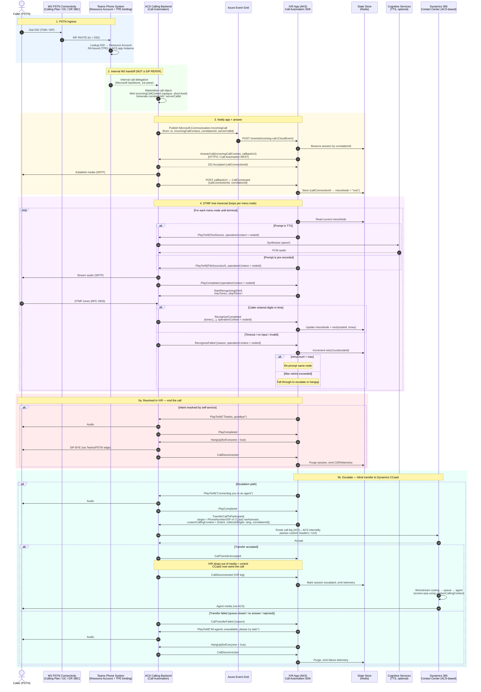
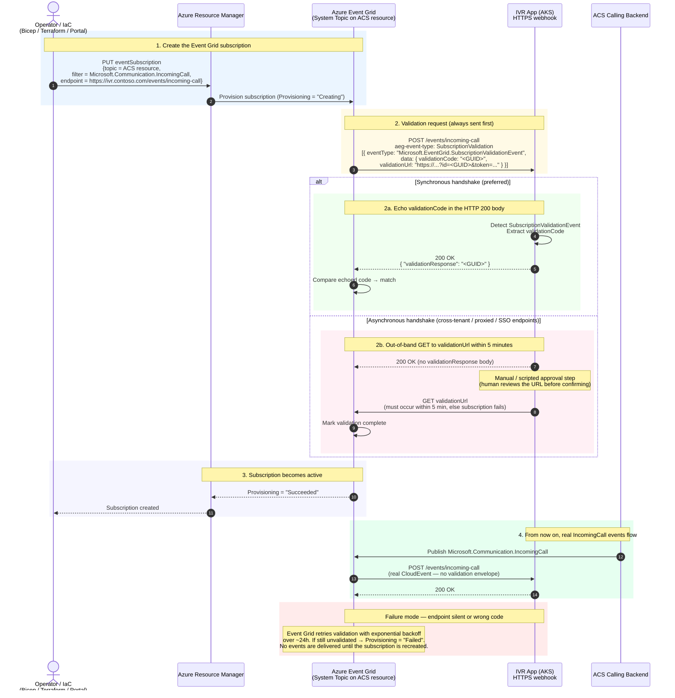
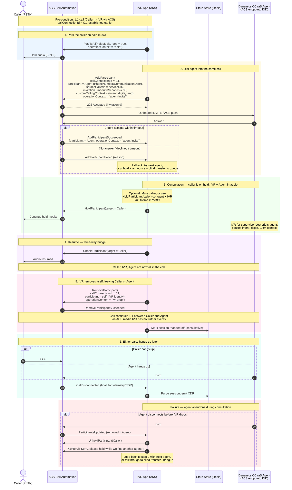

# Custom IVR Call Flow: PSTN → Teams RA → ACS Call Automation → Dynamics CCaaS

Here's the end-to-end call flow broken into the major hops, with the key control-plane messages on each leg.

---

## 1. PSTN → Teams Phone Resource Account

```
[Caller PSTN] ──► [MS PSTN connectivity*] ──► [Teams Phone System] ──► [Resource Account (RA)]
```

- The caller dials the PSTN DID assigned to the RA.
- Connectivity into Teams is one of: **Microsoft Calling Plans**, **Operator Connect**, or **Direct Routing (SBC)**.
- The number is hosted on a **Resource Account** — a disabled Entra ID user object licensed with Teams Phone Resource Account + a calling plan/OC/DR number.
- Normally an RA would route to an Auto Attendant or Call Queue. Here it is instead routed via **Teams Phone Extensibility (TPE)**.

## 2. Teams Phone Extensibility (TPE) → ACS

```
[Resource Account] ──TPE binding──► [ACS Communication Resource]
```

- TPE allows the RA to be associated with an **ACS resource** (the "Azure Communication Services – Teams Phone integration"). This is set up via `Set-CsOnlineApplicationInstanceAssociation` style configuration that points the RA at an ACS resource ID.
- When the call arrives at the RA, Teams hands it off to the bound ACS resource. From this point forward, **ACS owns the media path and signaling for the call**, but the call still consumes a Teams Phone number/license.
- ACS publishes an **`Microsoft.Communication.IncomingCall`** event to **Event Grid**. The event payload contains:
  - `from` (caller PSTN URI)
  - `to` (the Teams DID)
  - `callerDisplayName`
  - **`incomingCallContext`** — opaque token required to answer the call
  - `correlationId`, `serverCallId`


### What actually happens on the wire
Conceptually the flow is **Caller → Teams → ACS → (notify your app) → your app tells ACS to answer**. Teams does not transfer the call to your app; Teams transfers (internally) to **ACS**, and ACS then asks your app what to do.

```
Caller PSTN
   │  SIP/RTP (or PSTN TDM via carrier)
   ▼
Microsoft PSTN connectivity (Calling Plans / Operator Connect / Direct Routing SBC)
   │  SIP INVITE → Teams Phone System
   ▼
Teams Phone System
   │  Looks up the dialed DID → finds it assigned to a Resource Account (RA)
   │  RA has a TPE association to an ACS resource (the "Azure Communication Services
   │  Telephony" application instance, app ID 1ec4cb5b-…)
   │
   │  ── Internal Microsoft backend handoff (NOT a SIP REFER you can see) ──►
   ▼
ACS calling backend
   │  Materializes the call as an ACS call object, generates an `incomingCallContext`
   │  (an opaque, signed JWT-like token representing the call leg)
   │
   │  Publishes Microsoft.Communication.IncomingCall to Event Grid
   ▼
Your IVR app (AKS)
   │  Calls AnswerCall(incomingCallContext, callbackUri) via Call Automation SDK
   ▼
ACS answers the call → media path is now ACS ⇄ Caller; signaling/control is your app ⇄ ACS (HTTPS)
```
<details>
<summary><b>Why it is not a SIP transfer</b></summary>

A SIP transfer (REFER) implies one SIP UA telling another to re-INVITE a third party — visible signaling between independent endpoints. In TPE, none of those preconditions are true:

- **Same trust boundary.** Teams Phone System and ACS are both Microsoft 1st-party services. The handoff happens over Microsoft-internal APIs/fabric, not over a public SIP trunk.
- **No new INVITE is issued toward your app.** Your app never sees SIP. It sees an **HTTPS webhook (Event Grid CloudEvent)** describing an incoming call, and an **opaque `incomingCallContext`** it must present back to ACS to claim the call.
- **No media re-negotiation between Teams and ACS that you control.** SDP, codecs, transcoding (e.g., SILK ↔ G.711/Opus), and DTMF (RFC 2833 vs in-band) are handled by the Teams↔ACS interop layer.
- **The call is not "moved off" Teams.** The DID, licensing, and PSTN leg remain anchored on the Teams Phone side. ACS becomes the **call control + media endpoint** for the Teams-side participant. That is closer to a **delegation / federation** model than a transfer.

If you packet-capture an SBC in a Direct Routing setup, you'll see the original INVITE from your SBC into Teams — and that's it. The Teams→ACS hop is not exposed to the SBC.
</details>

## 3. Event Grid → Custom IVR App in AKS (Answer)

```
[Event Grid] ──webhook──► [IVR App in AKS] ──AnswerCall──► [ACS Call Automation]
                                            ◄──CallConnected── (to callback URI)
```

- Your AKS app exposes an HTTPS webhook subscribed to the `IncomingCall` event type on Event Grid (one-time validation handshake required).
- On receipt, the app decides to answer and invokes `CallAutomationClient.AnswerCallAsync(incomingCallContext, callbackUri)` (Call Automation SDK).
- The `callbackUri` is a second HTTPS endpoint on your AKS app — **all subsequent mid-call events** (`CallConnected`, `PlayCompleted`, `RecognizeCompleted`, `RecognizeFailed`, `CallDisconnected`, `CallTransferAccepted`, etc.) are POSTed there as **CloudEvents**, correlated by `callConnectionId`.
- After ACS connects media, you receive a `CallConnected` event — the IVR is now in control.

> Tip: keep the IncomingCall webhook and the mid-call callback on different routes; the first is Event Grid–shaped, the second is Call Automation CloudEvents–shaped.

---

## 4. IVR Loop: Play Audio + Recognize DTMF

```
[IVR App] ──PlayMedia──────────────────────► [ACS] ──audio──► caller
[IVR App] ──StartRecognizing(Dtmf)─────────► [ACS]
                                             ◄── RecognizeCompleted (digits) ── [IVR App]
[IVR App] ──(branch in DTMF tree)──► next PlayMedia / StartRecognizing ...
```

- **Play prompts**: `CallMedia.PlayToAllAsync(...)` or `PlayAsync(...)` with either:
  - `FileSource` (URL to a wav/mp3 reachable from ACS), or
  - `TextSource` (Cognitive Services TTS — requires the ACS resource to have a Cognitive Services connection).
- **Collect DTMF**: `CallMedia.StartRecognizingAsync(CallMediaRecognizeDtmfOptions)` with parameters:
  - `interToneTimeout`, `initialSilenceTimeout`
  - `maxTonesToCollect` (e.g., 1 for a menu, more for account number entry)
  - `stopTones` (e.g., `#`)
  - `interruptPrompt` (barge-in)
  - `operationContext` — the **menu node ID**; echoed back in events so you know which menu is responding.
- ACS posts back `RecognizeCompleted` (with `Tones`) or `RecognizeFailed` (timeout / no input). Your app consults its menu state machine (often keyed by `callConnectionId` + `operationContext`) and issues the next Play/Recognize. This is your DTMF tree traversal.

State for the IVR tree typically lives in a distributed cache (Redis) keyed by `callConnectionId`, since AKS pods are stateless and Event Grid / Call Automation callbacks may land on any pod.

---

## 5a. Resolution Path — End the Call

```
[IVR App] ──HangUp(forEveryone:true)──► [ACS] ──BYE──► [Teams] ──► [Caller]
                                          ◄── CallDisconnected ── [IVR App]
```

- `CallConnection.HangUpAsync(forEveryone: true)` ends the call for all parties.
- ACS emits a final `CallDisconnected` so the app can clear cache/state and emit telemetry/CDRs.

---

## 5b. Escalation Path — Transfer to Dynamics CCaaS

Dynamics 365 **Contact Center / Customer Service voice** is itself built on ACS, so the transfer target is reachable as an ACS/Teams identity or, more commonly, as a PSTN number / SIP URI exposed by the CCaaS workstream.

```
[IVR App] ──TransferCallToParticipant(target)──► [ACS Call Automation]
                                                  ◄── CallTransferAccepted ── [IVR App]
                                                  ◄── CallTransferFailed   ── (on failure)
```

- API: `CallConnection.TransferCallToParticipantAsync(TransferToParticipantOptions)`
- The `target` `CommunicationIdentifier` is one of:
  - `PhoneNumberIdentifier` (E.164) — a DID owned by the Dynamics CCaaS workstream / queue
  - `MicrosoftTeamsUserIdentifier` — if escalating to a Teams agent
  - SIP URI via `MicrosoftTeamsAppIdentifier` / Teams interop, depending on how the CCaaS tenant exposes the queue
- You can attach **custom calling context** (SIP headers / X-MS-Custom-* user-to-user info) on the transfer so the CCaaS workstream receives the IVR-collected data (intent, account number, language, etc.) and can route to the right queue / pop the right agent script.
- After ACS issues `CallTransferAccepted`, your app's call connection ends (you are no longer in the media path); the CCaaS workstream takes over and runs its own Call Automation / workflow against the same call.

> Note: this is a **REFER-style blind transfer** — your IVR drops out of the call once ACS confirms the transfer. If you need to stay in the call (consultative transfer, supervised handoff), use `AddParticipant` instead and remove yourself later.

---

## End-to-End Sequence (Happy-Path Escalation)

```
Caller PSTN
   │  (1) dial DID
   ▼
MS PSTN Connectivity ──► Teams Phone System ──► Resource Account
                                                      │ (2) TPE routing
                                                      ▼
                                                ACS Resource
                                                      │ (3) IncomingCall → EventGrid
                                                      ▼
                                              IVR App (AKS) ── AnswerCall ──► ACS
                                                      ◄── CallConnected ──
                                                      │
                                                      │ (4) PlayMedia / StartRecognizing(DTMF)  ◄── loop
                                                      │           ◄── RecognizeCompleted ──
                                                      ▼
                                              Branch decision
                                                ├─ (5a) HangUp ──► CallDisconnected
                                                └─ (5b) TransferCallToParticipant(Dynamics queue DID/SIP)
                                                              ──► CallTransferAccepted
                                                              ──► [Dynamics CCaaS owns the call]
```


## Things worth being deliberate about

| Area | Why it matters |
|---|---|
| **Webhook idempotency** | Event Grid and Call Automation both retry. Dedup on `id` / `(callConnectionId, sequenceNumber)`. |
| **State store** | Use Redis (or similar) keyed by `callConnectionId` for menu position; AKS pods are interchangeable. |
| **`operationContext`** | Set on every Play/Recognize so the callback tells you *which* menu node fired the event. |
| **Callback URI auth** | Use a per-call signing secret in the path or HMAC validation; the URI is internet-reachable. |
| **Cognitive Services link** | Required if you use `TextSource` (TTS) or want to swap to speech recognition later. |
| **Custom calling context on transfer** | The cleanest way to pass IVR context (intent, collected digits, language) into Dynamics CCaaS so the agent gets a screen-pop with state. |
| **Failure modes** | Handle `RecognizeFailed` (no input → re-prompt, max retries → operator), `CallTransferFailed` (queue closed → fallback Play + HangUp or voicemail), and `CallDisconnected` mid-flow (caller hangup → cleanup). |
| **Telemetry** | Correlate your app logs with ACS using `correlationId` / `serverCallId` from the IncomingCall payload — invaluable when diagnosing media or transfer issues with support. |
| **Licensing/path** | The DID is consumed on the **Teams** side; the **media + automation** runs in ACS. Both bills apply. |

---

## The mechanism, more precisely

1. **Binding.** The Resource Account is associated to ACS using:
   - `New-CsOnlineApplicationInstance` to create the RA,
   - PSTN number assignment to the RA, and
   - `Set-CsOnlineApplicationInstanceAssociation` (or the ACS portal "Telephony → Direct routing/Teams numbers") wiring the RA to the **ACS Telephony application instance** (the well-known ACS 1st-party app object in the tenant).

2. **Routing decision in Teams.** When a call hits the DID, Teams Phone System sees that the RA is bound to the ACS app instance and routes the call leg into the ACS calling backend instead of an Auto Attendant / Call Queue.

3. **ACS materializes the call.** ACS creates a call resource, mints an `incomingCallContext` (an opaque token that authorizes whoever holds it to answer/redirect/reject that specific call within a short TTL), and emits **`Microsoft.Communication.IncomingCall`** to Event Grid. Payload includes `from`, `to`, `callerDisplayName`, `incomingCallContext`, `correlationId`, `serverCallId`.

4. **Your app claims the call.** Your AKS app, subscribed to that Event Grid topic, decides what to do:
   - `AnswerCall(incomingCallContext, callbackUri)` — accept and start the IVR,
   - `RedirectCall(incomingCallContext, target)` — push it elsewhere without answering,
   - `RejectCall(incomingCallContext, reason)` — refuse it.
   These are **HTTPS calls to the ACS Call Automation API**, not SIP.

5. **Media.** Once answered, RTP/SRTP flows between the caller (via Microsoft's PSTN edge) and ACS's media stack. Your app is **not in the media path**; it is only in the control path (HTTPS webhooks + REST/SDK calls). That's why Play/Recognize work as REST verbs against ACS — ACS is the one actually playing audio and collecting DTMF.

---

## Mental model

Think of TPE as making the ACS resource look, to Teams Phone System, like just another **internal calling endpoint** that owns that DID — similar to how an Auto Attendant or Call Queue is an internal endpoint. Teams routes the call into that endpoint over the Microsoft backbone. ACS then exposes the call to *your* code via Event Grid + Call Automation, where the only "signaling" you ever touch is **HTTPS + JSON**.

---

## Practical implications for this IVR design

- **No SBC / SIP stack required in your app.** You only need: an HTTPS webhook for `IncomingCall`, an HTTPS webhook for mid-call CloudEvents, and the Call Automation SDK.
- **`incomingCallContext` is short-lived and single-use-ish.** Answer promptly; don't queue it for minutes.
- **Correlate with Teams via `correlationId` / `serverCallId`.** When opening a support case that spans Teams Phone and ACS, these are the IDs that let both sides find the same call.
- **Caller ID semantics.** `from` will reflect the PSTN caller; `to` is the Teams-assigned DID. If you later transfer to Dynamics CCaaS, you can preserve/override calling context via custom headers on `TransferCallToParticipant`.
- **DTMF reliability.** Because Teams↔ACS interop normalizes DTMF, you generally get clean RFC 2833 events surfaced as `RecognizeCompleted` regardless of how the carrier delivered them. You don't need to worry about in-band tones.
- **Failover.** If your app doesn't answer/redirect/reject within ACS's window, the call fails on the ACS side; Teams does not "fall back" to an Auto Attendant unless you explicitly `RedirectCall` to one.

---


# Appendix

## A. Detailed Sequence Diagram: PSTN → Teams → ACS → Custom IVR → Dynamics CCaaS

- Blue band (1) — public PSTN ingress and Teams routing decision.
- Green band (2) — the TPE handoff between Teams and ACS. Note this is an internal Microsoft delegation, not a SIP REFER, so there is no SIP signaling visible to your SBC/app on this leg.
- Yellow band (3) — IncomingCall arrives via Event Grid; your app answers via Call Automation. From here on, your app's signaling is HTTPS + CloudEvents, never SIP.
- Purple band (4) — the DTMF tree loop. Each menu node is a Play → Recognize cycle; operationContext carries the node ID through ACS so callbacks tell you exactly which menu fired the event. State lives in Redis keyed by callConnectionId, so any AKS pod can handle the next callback.
- Red band (5a) — clean self-service termination via HangUp.
- Teal band (5b) — blind transfer to Dynamics CCaaS via TransferCallToParticipant. Because Dynamics Contact Center is itself ACS-based, this is effectively an ACS-to-ACS transfer with custom calling context (UUI / X-MS headers) carrying the IVR-collected data for screen-pop. The IVR drops out once CallTransferAccepted fires; the failure branch is shown explicitly so you don't lose the caller if the workstream rejects.



---

## B. Event Grid Subscription Validation Handshake

This is the **one-time bootstrap** that happens when you first create (or update) the Event Grid subscription that points at your IVR's `IncomingCall` webhook. Event Grid will not deliver real events until your endpoint proves it owns the URL.

There are two supported modes — **synchronous** (return the validation code in the HTTP response) and **asynchronous** (call back a one-time validation URL within 5 minutes). Both are shown.



### Key things to bake into your handler

- **Detect the validation envelope first** — check `eventType == "Microsoft.EventGrid.SubscriptionValidationEvent"` (or header `aeg-event-type: SubscriptionValidation`) before treating the payload as a real event.
- **Return the code synchronously** when you can; it's simpler and less error-prone than the async URL flow.
- **Don't require auth on the validation request itself** — Event Grid won't carry your bearer token. Use a hard-to-guess URL path + payload validation, or front the endpoint with Event Grid's built-in delivery options (managed identity / WebHook secret).
- **Log the `validationCode`** so that if you ever need the async path, you can hit the URL manually within the 5-minute window.

---

## C. Consultative (Attended) Transfer via AddParticipant + RemoveParticipant

Different from the blind `TransferCallToParticipant` you saw earlier — here the IVR (or supervisor) **stays on the call**, brings the agent in, talks to them, and only then drops out.



### Why use this over a blind transfer

| Aspect | Blind (`TransferCallToParticipant`) | Consultative (`AddParticipant` + `RemoveParticipant`) |
|---|---|---|
| IVR stays in call during handoff | No — drops immediately on `CallTransferAccepted` | Yes — until `RemoveParticipant` |
| Can brief the agent | No (rely on UUI / screen-pop only) | Yes (live audio briefing) |
| Caller experience on agent reject | Lost unless you handle `CallTransferFailed` | Caller never disconnected; just stays on hold |
| Cost / complexity | Lower — fewer events, simpler state | Higher — must manage 3-party media + per-leg events |
| Best for | High-volume, well-known queues | VIP, complex escalations, supervisor takeover |

---

## D. Failure / Retry Timing with Concrete Timeouts

This diagram makes the **time dimension** explicit so you can size your retries, prompts, and SLAs. All values are the documented ACS Call Automation / Event Grid defaults — tune to your traffic.

```mermaid
sequenceDiagram
    autonumber
    actor Caller as Caller
    participant ACS as ACS Call Automation
    participant EG as Event Grid
    participant IVR as IVR App (AKS)

    Note over Caller,IVR: All times are wall-clock - counters reset per call leg

    %% ───────────── Event Grid delivery retries ─────────────
    rect rgb(235, 245, 255)
    Note over ACS,IVR: 1. Event Grid delivery — applies to IncomingCall and<br/>any callback ACS publishes via Event Grid
    ACS->>EG: Publish event
    EG->>IVR: POST webhook (attempt 1)
    Note over IVR: Endpoint down / 5xx / timeout (>30s)
    EG->>EG: Schedule retry with exponential backoff<br/>10s, 30s, 1m, 5m, 10m, 30m, 1h, 3h, 6h, 12h
    EG->>IVR: POST webhook (attempt N)
    Note over EG: Default Event Time-To-Live = 24h<br/>After TTL → dead-letter (if configured) or drop
    EG-->>IVR: Give up after 24h<br/>→ caller already gone - reconcile via CDR
    end

    %% ───────────── IncomingCall answer window ─────────────
    rect rgb(255, 250, 230)
    Note over ACS,IVR: 2. AnswerCall must happen quickly
    ACS->>IVR: IncomingCall (incomingCallContext valid ~60s)
    Note over IVR: Must call AnswerCall / Redirect / Reject<br/>before token expires (~60s).<br/>Caller hears ringback during this window.
    alt App responds in time
        IVR->>ACS: AnswerCall(...)
        ACS-->>Caller: Connect media
    else App misses the window
        ACS->>Caller: Call fails (480 / 408 upstream)
        ACS->>IVR: (no CallConnected -- no further events)
    end
    end

    %% ───────────── Recognize timeouts ─────────────
    rect rgb(250, 240, 255)
    Note over IVR,Caller: 3. StartRecognizing — timeout structure
    IVR->>ACS: StartRecognizing(Dtmf,<br/>  initialSilenceTimeout = 5s,<br/>  interToneTimeout = 2s,<br/>  maxTonesToCollect = 4,<br/>  stopTones = ["#"],<br/>  interruptPrompt = true,<br/>  operationContext = "menu-main")

    par Prompt playing
        ACS->>Caller: Play prompt audio
    and Listening for tones
        Note over ACS: Window 1: initialSilenceTimeout (5s)<br/>starts AFTER prompt ends (or on barge-in)
    end

    alt Caller presses first digit in time
        Caller->>ACS: DTMF "2"
        Note over ACS: Window 2: interToneTimeout (2s)<br/>resets on every new digit
        Caller->>ACS: DTMF "#"
        ACS->>IVR: RecognizeCompleted {tones:["2","#"], context:"menu-main"}
    else No first digit within initialSilenceTimeout
        ACS->>IVR: RecognizeFailed {reason: "InitialSilenceTimeout"}
    else Stops typing after partial input
        Caller->>ACS: DTMF "2"
        Note over ACS: 2s elapses with no further digit
        ACS->>IVR: RecognizeCompleted {tones:["2"], context:"menu-main"}<br/>(or RecognizeFailed if maxTones not met,<br/>depending on stopTones config)
    end
    end

    %% ───────────── App-level retry policy ─────────────
    rect rgb(255, 240, 230)
    Note over IVR,Caller: 4. Application-level retry / escalation policy
    loop retryCount < 3
        IVR->>ACS: PlayToAll("I didn't catch that — please press...")
        ACS->>Caller: Re-prompt
        IVR->>ACS: StartRecognizing(...)
        alt Success
            ACS->>IVR: RecognizeCompleted
            Note over IVR: Break out of retry loop
        else Failure
            ACS->>IVR: RecognizeFailed
            IVR->>IVR: retryCount++
        end
    end
    Note over IVR: After 3 failures → escalate to agent<br/>or play "transferring you to an operator"
    end

    %% ───────────── Transfer timing ─────────────
    rect rgb(235, 255, 250)
    Note over IVR,ACS: 5. Transfer / AddParticipant timing
    IVR->>ACS: TransferCallToParticipant(target)
    Note over ACS: Default ringing window ~60s<br/>(no per-call override on blind transfer -<br/>use AddParticipant for explicit invitationTimeoutInSeconds)
    alt Accepted
        ACS->>IVR: CallTransferAccepted (typically <10s)
    else Timeout / busy / declined
        ACS->>IVR: CallTransferFailed {reason}
        Note over IVR: Fall back: re-queue, voicemail, or hangup
    end

    Note over IVR,ACS: AddParticipant supports invitationTimeoutInSeconds<br/>(default 60s, max 180s)
    end

    %% ───────────── Idempotency / duplicate delivery ─────────────
    rect rgb(255, 235, 235)
    Note over EG,IVR: 6. At-least-once delivery — handle duplicates
    EG->>IVR: Event {id = E1, sequenceNumber = 7}
    IVR->>IVR: Check (callConnectionId, sequenceNumber) in dedup cache
    IVR-->>EG: 200 OK
    EG->>IVR: Event {id = E1, sequenceNumber = 7} (retry — original 200 was lost)
    IVR->>IVR: Already processed → no-op
    IVR-->>EG: 200 OK
    end
```



### Suggested defaults to start with

| Knob | Default | When to change |
|---|---|---|
| `initialSilenceTimeout` | **5 s** | Increase to 7–10 s for elderly demographics or noisy lines |
| `interToneTimeout` | **2 s** | Increase to 3–5 s for long inputs (account numbers) |
| `maxTonesToCollect` | **1** for menus, **N** for IDs | Set with `stopTones=["#"]` to allow early submit |
| `interruptPrompt` | **true** | Set false only for legal/disclosure prompts that must be heard |
| App retry count | **3** then escalate | Lower for short menus; higher for ID capture |
| `invitationTimeoutInSeconds` (AddParticipant) | **30 s** | Raise to 60–120 s for sparse agent pools |
| Event Grid TTL | **24 h** (default) | Lower to 1 h for real-time-only events; configure dead-lettering to a Storage account either way |
| Webhook handler SLA | **<3 s** typical, **<30 s** hard | Anything slower will cause Event Grid retries and duplicate processing |
| `incomingCallContext` validity | **~60 s** | Not configurable — your Answer/Redirect/Reject path must be fast |

### Production hardening checklist this implies

- **Dead-letter queue** on the Event Grid subscription pointing to a Storage container, so a webhook outage doesn't silently lose calls — you can replay later for CDR/audit reconciliation.
- **Dedup cache** keyed by `(callConnectionId, sequenceNumber)` with TTL ≥ longest expected call duration.
- **Circuit breaker** on the IVR webhook: if downstream (Redis / Cognitive Services / CCaaS API) is unhealthy, return a fast `RedirectCall` to a safe destination (Auto Attendant with "we're experiencing issues") instead of holding the `incomingCallContext`.
- **Per-leg correlation**: log `correlationId`, `serverCallId`, `callConnectionId`, and `operationContext` on every line — these are the only IDs that join Teams-side, ACS-side, and CCaaS-side traces in a support case.
- **Synthetic call tests** that exercise the full path (PSTN → Teams → ACS → IVR → CCaaS) at least every 5 minutes from an external prober, since none of the individual Azure health signals will catch a TPE binding regression.

