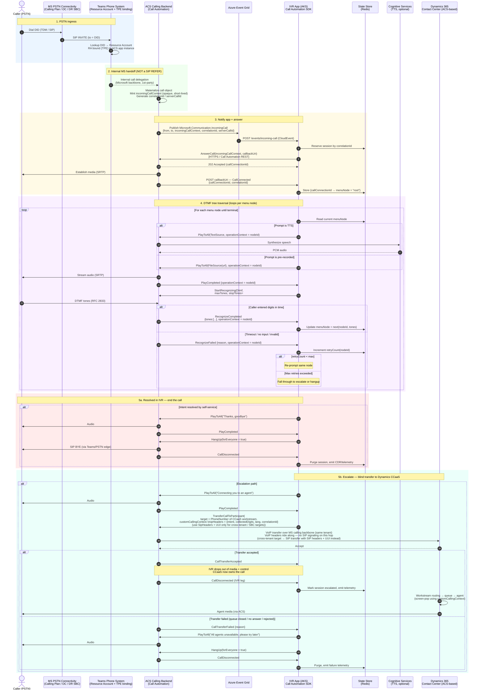

# Detailed Sequence Diagram: PSTN → Teams → ACS → Custom IVR → Dynamics CCaaS

The wire-level happy-path escalation, end to end. The narrative for each band lives in [`call-flow.md`](call-flow.md); this file is the picture.

- **Blue band (1)** — public PSTN ingress and Teams routing decision.
- **Green band (2)** — the TPE handoff between Teams and ACS. Note this is an internal Microsoft delegation, not a SIP REFER, so there is no SIP signaling visible to your SBC/app on this leg.
- **Yellow band (3)** — `IncomingCall` arrives via Event Grid; your app answers via Call Automation. From here on, your app's signaling is HTTPS + CloudEvents, never SIP.
- **Purple band (4)** — the DTMF tree loop. Each menu node is a Play → Recognize cycle; `operationContext` carries the node ID through ACS so callbacks tell you exactly which menu fired the event. State lives in Redis keyed by `callConnectionId`, so any AKS pod can handle the next callback.
- **Red band (5a)** — clean self-service termination via `HangUp`.
- **Teal band (5b)** — blind transfer to Dynamics CCaaS via `TransferCallToParticipant`. When the workstream's DID is in the **same tenant** as the IVR's RA (the common case), this is a **VoIP transfer** on the Microsoft calling backbone — no SIP signaling leaves the fabric and IVR-collected context rides as **VoIP headers** in `CustomCallingContext.VoipHeaders` (1,000 headers, value ≤ 1,024 chars). Only when the target lives in a **different tenant** or behind your SBC (Direct Routing) is it a true **SIP transfer**, in which case context must go via `SipHeaders` + the SIP **UUI** header (≤ 5 headers with `X-*` / `X-MS-Custom-*` prefix, value ≤ 256 chars). The IVR drops out once `CallTransferAccepted` fires regardless of transport; the failure branch is shown explicitly so you don't lose the caller if the workstream rejects. Full transport-decision rules live in [`transfer-patterns.md`](transfer-patterns.md).

## See also

- [`call-flow.md`](call-flow.md) — narrative walkthrough of each band.
- [`transfer-patterns.md`](transfer-patterns.md) — VoIP-vs-SIP transport rules and the consultative-transfer alternative.
- [`../runbooks/event-grid-incomingcall-subscription.md`](../runbooks/event-grid-incomingcall-subscription.md) — the validation handshake that has to succeed before band (3) can ever fire.
- [`../runbooks/timing-and-retries.md`](../runbooks/timing-and-retries.md) — concrete timeouts on every arrow in this diagram.
