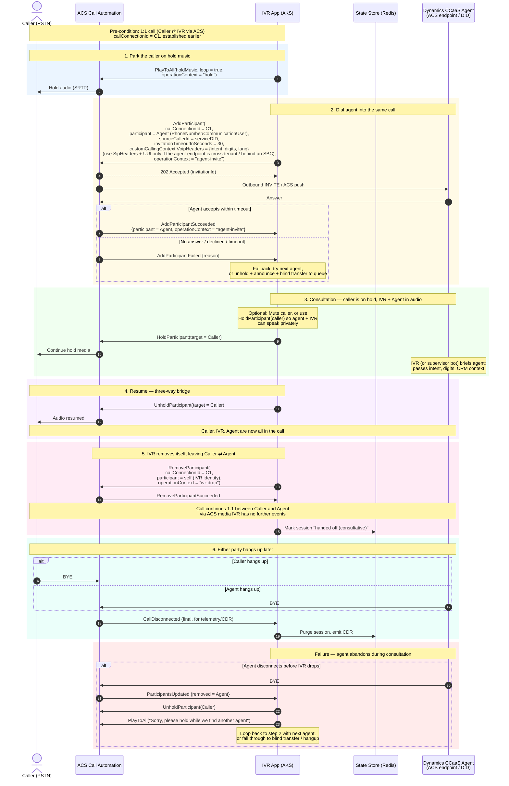

# Transfer Patterns: Blind vs Consultative, VoIP vs SIP

This file is the implementation reference for **escalating a call out of the custom IVR**. ADR-0005 fixes the *policy* (blind by default, consultative reserved for VIP/supervisor); this document covers the *mechanics* — when each transport applies, which custom-context bucket to use, and what the wire actually does.

The narrative for the rest of the call flow lives in [`call-flow.md`](call-flow.md). The detailed end-to-end sequence diagram is in [`sequence-diagrams.md`](sequence-diagrams.md).

## Blind transfer — `TransferCallToParticipant`

When the IVR has gathered enough context (selected workstream, collected ID, language) it hands the caller to Dynamics CCaaS in one shot. The call leaves the IVR completely and CCaaS becomes the new owner.

The IVR calls `TransferCallToParticipant(targetPhoneNumber, options)`. ACS issues the transfer to the target on the IVR's behalf and the IVR drops out of media and control. The IVR receives `CallTransferAccepted` (success) or `CallTransferFailed` (queue closed / no answer / rejected). Failed transfers should fall back to "all agents unavailable" + hangup, or — if the routing layer supports it — re-queue elsewhere.

### Transport choice: VoIP transfer vs SIP transfer

Whether ACS performs a **VoIP transfer** or a **SIP transfer** is determined by the *target endpoint*, not by an SDK switch. This drives which custom-context bucket your code must populate.

| Target of the transfer | Transport ACS uses | Where context goes |
|---|---|---|
| DID belonging to a Resource Account / workstream **in the same Azure Communication Services tenant** as the IVR (e.g. Dynamics CCaaS workstream provisioned alongside the IVR) | **VoIP transfer** over the Microsoft calling backbone — no SIP signaling visible to your app or to an SBC | `CustomCallingContext.VoipHeaders` (free-form, up to 1,000 entries, value ≤ 1,024 chars, no required prefix) |
| DID in a **different tenant** (cross-tenant Teams) | **SIP transfer** | `CustomCallingContext.SipHeaders` (≤ 5 custom headers, names must be `X-*` or `X-MS-Custom-*`, value ≤ 256 chars) and / or `CustomCallingContext.AddSipUui(...)` (UUI ≤ 256 chars) |
| Off-net PSTN target reached via your **Direct Routing SBC** | **SIP transfer** out the SBC | Same as cross-tenant — SIP headers + UUI |

Same-tenant is the common path for an in-tenant CCaaS deployment, so VoIP headers are the default in this architecture. If your topology spans tenants, plan for the much tighter SIP header limits (5 headers, ~256 chars per value) and decide what subset of the IVR context is critical enough to make the cut.

### C# — populating context for the same-tenant case

```csharp
var transferOptions = new TransferToParticipantOptions(
    new PhoneNumberIdentifier(workstreamPhoneNumber))
{
    OperationContext = "escalate-to-ccaas"
};

// Same-tenant target → VoIP transfer → use VoipHeaders.
transferOptions.CustomCallingContext.AddVoip("intent", session.SelectedIntent);
transferOptions.CustomCallingContext.AddVoip("digits", session.CollectedDigits);
transferOptions.CustomCallingContext.AddVoip("lang", session.LanguageCode);
transferOptions.CustomCallingContext.AddVoip("correlationId", session.CorrelationId);

// Cross-tenant or SBC target → switch to SIP headers + UUI:
// transferOptions.CustomCallingContext.AddSipX("X-MS-Custom-Intent", session.SelectedIntent);
// transferOptions.CustomCallingContext.AddSipUui(session.CorrelationId);

await callConnection.TransferCallToParticipantAsync(transferOptions);
```

This is the only place in the architecture where the same-tenant assumption shows up in code. If you ever introduce a cross-tenant or SBC-routed workstream, this is the call site that needs a branch.

## Consultative (attended) transfer — `AddParticipant` + `RemoveParticipant`

Different from the blind transfer above — here the IVR (or supervisor) **stays on the call**, brings the agent in, talks to them, and only then drops out. ADR-0005 gates this to VIP / supervisor takeover scenarios because of the extra cost and complexity.



The same VoIP-vs-SIP transport rule applies on `AddParticipant` — same-tenant agent endpoint = VoIP transfer + `VoipHeaders`; cross-tenant or SBC target = SIP transfer + `SipHeaders` / UUI.

### Why use this over a blind transfer

| Aspect | Blind (`TransferCallToParticipant`) | Consultative (`AddParticipant` + `RemoveParticipant`) |
|---|---|---|
| IVR stays in call during handoff | No — drops immediately on `CallTransferAccepted` | Yes — until `RemoveParticipant` |
| Can brief the agent | No (rely on `CustomCallingContext` / screen-pop only — VoIP or SIP headers depending on tenancy) | Yes (live audio briefing, plus the same `CustomCallingContext` payload on `AddParticipant`) |
| Caller experience on agent reject | Lost unless you handle `CallTransferFailed` | Caller never disconnected; just stays on hold |
| Cost / complexity | Lower — fewer events, simpler state | Higher — must manage 3-party media + per-leg events |
| Best for | High-volume, well-known queues | VIP, complex escalations, supervisor takeover |

## See also

- [ADR-0005](../adr/0005-escalation-blind-vs-consultative-transfer.md) — the policy decision (blind by default).
- [`call-flow.md`](call-flow.md) — where in the overall flow the transfer fits.
- [`sequence-diagrams.md`](sequence-diagrams.md) — wire-level picture of the blind-transfer happy path.
- Microsoft Learn: [Pass contextual data between calls](https://learn.microsoft.com/azure/communication-services/concepts/voice-video-calling/custom-calling-context) — authoritative limits on VoIP/SIP custom headers and UUI.
