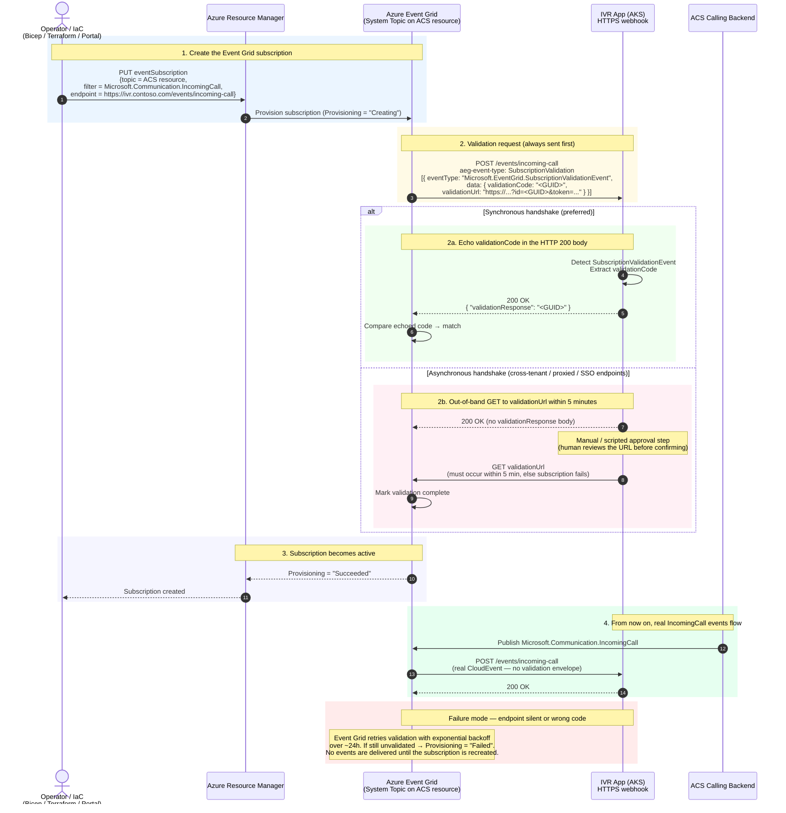

# Runbook: Subscribing to `Microsoft.Communication.IncomingCall` via Event Grid

This is the **one-time bootstrap** that has to succeed before your IVR can ever receive a call. When you (or your IaC) first create — or update — the Event Grid subscription that points at your IVR's `IncomingCall` webhook, Event Grid will not deliver real events until your endpoint proves it owns the URL by completing the validation handshake.

Two modes are supported:

- **Synchronous** — return the validation code in the HTTP 200 body. Preferred. Simpler, less error-prone, the default for first-party Microsoft endpoints.
- **Asynchronous** — call back a one-time validation URL within 5 minutes. Required when your endpoint is fronted by SSO / a proxy / cross-tenant policies that block the Event Grid validation request from reaching it.

Both flows are shown below.

## Key things to bake into your handler

- **Detect the validation envelope first** — check `eventType == "Microsoft.EventGrid.SubscriptionValidationEvent"` (or header `aeg-event-type: SubscriptionValidation`) before treating the payload as a real event.
- **Return the code synchronously** when you can; it's simpler and less error-prone than the async URL flow.
- **Don't require auth on the validation request itself** — Event Grid won't carry your bearer token. Use a hard-to-guess URL path + payload validation, or front the endpoint with Event Grid's built-in delivery options (managed identity / WebHook secret).
- **Log the `validationCode`** so that if you ever need the async path, you can hit the URL manually within the 5-minute window.

## Related

- [ADR-0003 — `IncomingCall` delivery via Event Grid](../adr/0003-incomingcall-delivery-via-event-grid.md) for the *why*.
- [`../architecture/call-flow.md`](../architecture/call-flow.md) §3 for where this subscription fits into the runtime call flow.
- [`timing-and-retries.md`](timing-and-retries.md) for the Event Grid retry/TTL schedule once the subscription is live.
