# Runbook: Failure / Retry Timing with Concrete Timeouts

This page makes the **time dimension** of the architecture explicit so you can size retries, prompts, and SLAs. All values are the documented ACS Call Automation / Event Grid defaults — tune to your traffic.

The narrative for the rest of the call flow lives in [`../architecture/call-flow.md`](../architecture/call-flow.md); the wire-level diagram is in [`../architecture/sequence-diagrams.md`](../architecture/sequence-diagrams.md).

```mermaid
sequenceDiagram
    autonumber
    actor Caller as Caller
    participant ACS as ACS Call Automation
    participant EG as Event Grid
    participant IVR as IVR App (AKS)

    Note over Caller,IVR: All times are wall-clock - counters reset per call leg

    %% ───────────── Event Grid delivery retries ─────────────
    rect rgb(235, 245, 255)
    Note over ACS,IVR: 1. Event Grid delivery — applies to IncomingCall and<br/>any callback ACS publishes via Event Grid
    ACS->>EG: Publish event
    EG->>IVR: POST webhook (attempt 1)
    Note over IVR: Endpoint down / 5xx / timeout (>30s)
    EG->>EG: Schedule retry with exponential backoff<br/>10s, 30s, 1m, 5m, 10m, 30m, 1h, 3h, 6h, 12h
    EG->>IVR: POST webhook (attempt N)
    Note over EG: Default Event Time-To-Live = 24h<br/>After TTL → dead-letter (if configured) or drop
    EG-->>IVR: Give up after 24h<br/>→ caller already gone - reconcile via CDR
    end

    %% ───────────── IncomingCall answer window ─────────────
    rect rgb(255, 250, 230)
    Note over ACS,IVR: 2. AnswerCall must happen quickly
    ACS->>IVR: IncomingCall (incomingCallContext valid ~60s)
    Note over IVR: Must call AnswerCall / Redirect / Reject<br/>before token expires (~60s).<br/>Caller hears ringback during this window.
    alt App responds in time
        IVR->>ACS: AnswerCall(...)
        ACS-->>Caller: Connect media
    else App misses the window
        ACS->>Caller: Call fails (480 / 408 upstream)
        ACS->>IVR: (no CallConnected -- no further events)
    end
    end

    %% ───────────── Recognize timeouts ─────────────
    rect rgb(250, 240, 255)
    Note over IVR,Caller: 3. StartRecognizing — timeout structure
    IVR->>ACS: StartRecognizing(Dtmf,<br/>  initialSilenceTimeout = 5s,<br/>  interToneTimeout = 2s,<br/>  maxTonesToCollect = 4,<br/>  stopTones = ["#"],<br/>  interruptPrompt = true,<br/>  operationContext = "menu-main")

    par Prompt playing
        ACS->>Caller: Play prompt audio
    and Listening for tones
        Note over ACS: Window 1: initialSilenceTimeout (5s)<br/>starts AFTER prompt ends (or on barge-in)
    end

    alt Caller presses first digit in time
        Caller->>ACS: DTMF "2"
        Note over ACS: Window 2: interToneTimeout (2s)<br/>resets on every new digit
        Caller->>ACS: DTMF "#"
        ACS->>IVR: RecognizeCompleted {tones:["2","#"], context:"menu-main"}
    else No first digit within initialSilenceTimeout
        ACS->>IVR: RecognizeFailed {reason: "InitialSilenceTimeout"}
    else Stops typing after partial input
        Caller->>ACS: DTMF "2"
        Note over ACS: 2s elapses with no further digit
        ACS->>IVR: RecognizeCompleted {tones:["2"], context:"menu-main"}<br/>(or RecognizeFailed if maxTones not met,<br/>depending on stopTones config)
    end
    end

    %% ───────────── App-level retry policy ─────────────
    rect rgb(255, 240, 230)
    Note over IVR,Caller: 4. Application-level retry / escalation policy
    loop retryCount < 3
        IVR->>ACS: PlayToAll("I didn't catch that — please press...")
        ACS->>Caller: Re-prompt
        IVR->>ACS: StartRecognizing(...)
        alt Success
            ACS->>IVR: RecognizeCompleted
            Note over IVR: Break out of retry loop
        else Failure
            ACS->>IVR: RecognizeFailed
            IVR->>IVR: retryCount++
        end
    end
    Note over IVR: After 3 failures → escalate to agent<br/>or play "transferring you to an operator"
    end

    %% ───────────── Transfer timing ─────────────
    rect rgb(235, 255, 250)
    Note over IVR,ACS: 5. Transfer / AddParticipant timing
    IVR->>ACS: TransferCallToParticipant(target)
    Note over ACS: Default ringing window ~60s<br/>(no per-call override on blind transfer -<br/>use AddParticipant for explicit invitationTimeoutInSeconds)
    alt Accepted
        ACS->>IVR: CallTransferAccepted (typically <10s)
    else Timeout / busy / declined
        ACS->>IVR: CallTransferFailed {reason}
        Note over IVR: Fall back: re-queue, voicemail, or hangup
    end

    Note over IVR,ACS: AddParticipant supports invitationTimeoutInSeconds<br/>(default 60s, max 180s)
    end

    %% ───────────── Idempotency / duplicate delivery ─────────────
    rect rgb(255, 235, 235)
    Note over EG,IVR: 6. At-least-once delivery — handle duplicates
    EG->>IVR: Event {id = E1, sequenceNumber = 7}
    IVR->>IVR: Check (callConnectionId, sequenceNumber) in dedup cache
    IVR-->>EG: 200 OK
    EG->>IVR: Event {id = E1, sequenceNumber = 7} (retry — original 200 was lost)
    IVR->>IVR: Already processed → no-op
    IVR-->>EG: 200 OK
    end
```

## Suggested defaults to start with

| Knob | Default | When to change |
|---|---|---|
| `initialSilenceTimeout` | **5 s** | Increase to 7–10 s for elderly demographics or noisy lines |
| `interToneTimeout` | **2 s** | Increase to 3–5 s for long inputs (account numbers) |
| `maxTonesToCollect` | **1** for menus, **N** for IDs | Set with `stopTones=["#"]` to allow early submit |
| `interruptPrompt` | **true** | Set false only for legal/disclosure prompts that must be heard |
| App retry count | **3** then escalate | Lower for short menus; higher for ID capture |
| `invitationTimeoutInSeconds` (AddParticipant) | **30 s** | Raise to 60–120 s for sparse agent pools |
| Event Grid TTL | **24 h** (default) | Lower to 1 h for real-time-only events; configure dead-lettering to a Storage account either way |
| Webhook handler SLA | **<3 s** typical, **<30 s** hard | Anything slower will cause Event Grid retries and duplicate processing |
| `incomingCallContext` validity | **~60 s** | Not configurable — your Answer/Redirect/Reject path must be fast |

## Production hardening checklist

- **Dead-letter queue** on the Event Grid subscription pointing to a Storage container, so a webhook outage doesn't silently lose calls — you can replay later for CDR/audit reconciliation.
- **Dedup cache** keyed by `(callConnectionId, sequenceNumber)` with TTL ≥ longest expected call duration.
- **Circuit breaker** on the IVR webhook: if downstream (Redis / Cognitive Services / CCaaS API) is unhealthy, return a fast `RedirectCall` to a safe destination (Auto Attendant with "we're experiencing issues") instead of holding the `incomingCallContext`.
- **Per-leg correlation**: log `correlationId`, `serverCallId`, `callConnectionId`, and `operationContext` on every line — these are the only IDs that join Teams-side, ACS-side, and CCaaS-side traces in a support case.
- **Synthetic call tests** that exercise the full path (PSTN → Teams → ACS → IVR → CCaaS) at least every 5 minutes from an external prober, since none of the individual Azure health signals will catch a TPE binding regression.

## Related

- [ADR-0003](../adr/0003-incomingcall-delivery-via-event-grid.md) — at-least-once delivery and dead-lettering rationale.
- [ADR-0004](../adr/0004-call-state-in-redis-by-callconnectionid.md) — why state is keyed by `callConnectionId` and how the dedup contract is enforced.
- [ADR-0008](../adr/0008-graceful-degradation-realtime-to-dtmf.md) — the synthetic-call probers above are the harness for the per-tier health signals this ADR depends on.
- [`event-grid-incomingcall-subscription.md`](event-grid-incomingcall-subscription.md) — the validation handshake that has to succeed before anything in this runbook applies.
