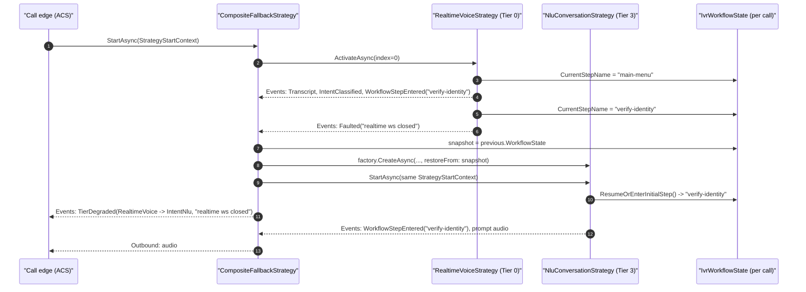

# Conversation strategies

> Source of truth: [`src/AgentFramework/Agents.AI.ContactCenter/Calling/`](../../src/AgentFramework/Agents.AI.ContactCenter/Calling/).
> Companion ADR: [ADR-0008 — Graceful degradation: Realtime → DTMF](../adr/0008-graceful-degradation-realtime-to-dtmf.md).

A **conversation strategy** is the "brain" of an active call. The call session owns the caller edge (ACS Call Automation, media-streaming WebSocket, DTMF callbacks) and delegates *what to say next* to a single [`IConversationStrategy`](../../src/AgentFramework/Agents.AI.ContactCenter/Calling/IConversationStrategy.cs). Strategies do not own a socket — they read inbound frames and DTMF from channels the session hands them, and they write `OutboundDirective`s and `StrategyEvent`s back to channels the session pumps to the edge and to observers.

Per-call wiring is built up in `CallSessionContainerExtensions`:

```csharp
builder.AddCallSessionContainer()
    .AddRealtimeVoiceStrategy(realtimeAgentServiceKey: AgentConfig.TriageAgent)  // Tier 0
    .AddNluStrategy()                                                            // Tier 3
    .AddDtmfStrategy()                                                           // Tier 4
    .AddCallControlTools()
    .AddCallerAuthentication()
    .AddCallerAuthenticator<AniIdentityLookupAuthenticator>()
    .AddTransferEscalationTarget(ShowcaseWorkflowIds.DefaultEscalationNumber)
    .AddCompositeFallbackStrategy(
        topTier: AgentTier.RealtimeVoice,
        AgentTier.RealtimeVoice, AgentTier.IntentNlu, AgentTier.DtmfOnly);
```

## The contract

```csharp
public interface IConversationStrategy : IAsyncDisposable
{
    StrategyKind Kind { get; }
    AgentTier Tier { get; }
    IvrWorkflowState WorkflowState { get; }          // shared across tier swaps
    EdgeCapabilities EmittedDirectives { get; }
    ChannelReader<OutboundDirective> Outbound { get; }
    ChannelReader<StrategyEvent> Events { get; }

    Task StartAsync(StrategyStartContext context, CancellationToken ct = default);
    ValueTask PrewarmAsync(IServiceProvider services, CancellationToken ct = default);
    Task StopAsync(CancellationToken ct = default);
    ValueTask SuspendAsync(CancellationToken ct = default);
    ValueTask ResumeAsync(CancellationToken ct = default);
}
```

`StrategyStartContext` is the call-scoped "everything you need" record:

```csharp
public sealed record StrategyStartContext
{
    public required string CallId { get; init; }
    public required ChannelReader<AudioFrame> InboundAudio { get; init; }
    public required ChannelReader<DtmfTone>   InboundDtmf  { get; init; }
    public required IServiceProvider Services { get; init; }   // call-scoped DI
    public CallEdgeMetadata?  CallerMetadata { get; init; }
    public IvrWorkflowState?  RestoreFrom    { get; init; }   // populated on degradation
}
```

Two things in that record are the basis of every handoff between strategies:

1. **`IvrWorkflowState RestoreFrom`** — the workflow snapshot threaded from the previous strategy.
2. **`IServiceProvider Services`** — the per-call DI scope shared by every strategy that runs on that call.

## The strategy catalog

| Strategy | Tier | Kind | Owns | Typical inbound | Typical outbound | Emits |
| --- | --- | --- | --- | --- | --- | --- |
| [`RealtimeVoiceStrategy`](../../src/AgentFramework/Agents.AI.ContactCenter/Calling/Strategies/RealtimeVoice/RealtimeVoiceStrategy.cs) | `RealtimeVoice` | `RealtimeVoice` | `IRealtimeVoiceBackend` (wraps `AuthorizingRealtimeAIAgent`) | PCM audio | PCM audio, stop-playback, transfer | `Transcript`, `AgentUtterance`, `FunctionCalled`, `IntentClassified`, `EscalationRequested` |
| [`NluConversationStrategy`](../../src/AgentFramework/Agents.AI.ContactCenter/Calling/Strategies/Nlu/NluConversationStrategy.cs) | `IntentNlu` | `Nlu` | `IvrIntentAgent` + `ISpeechSynthesizer` | PCM audio | Synthesized PCM, transfer | `Transcript`, `IntentClassified`, `WorkflowStepEntered`, `EscalationRequested` |
| [`DtmfStreamingStrategy`](../../src/AgentFramework/Agents.AI.ContactCenter/Calling/Strategies/Dtmf/DtmfStreamingStrategy.cs) | `DtmfOnly` | `Dtmf` | YAML workflow + `ISpeechSynthesizer` | DTMF tones | Synthesized PCM, transfer | `DtmfRecognized`, `WorkflowStepEntered`, `EscalationRequested` |
| [`DtmfVerbStrategy`](../../src/AgentFramework/Agents.AI.ContactCenter/Calling/Strategies/Dtmf/DtmfVerbStrategy.cs) | `DtmfOnly` | `Dtmf` | YAML workflow | DTMF tones | `SpeakText` + `CollectDtmf` verbs | same as above |
| [`CompositeFallbackStrategy`](../../src/AgentFramework/Agents.AI.ContactCenter/Calling/Strategies/Composite/CompositeFallbackStrategy.cs) | `Tier` of active inner | `Composite` | An ordered list of `IConversationStrategyFactory` | passthrough | passthrough | passthrough + `TierDegraded` |

All inner strategies expose the same `Outbound`/`Events` channels, so the call edge code is identical regardless of which tier is currently active.

## Where state lives

Two kinds of state flow across a call:

| State | Lifetime | How it survives handoff |
| --- | --- | --- |
| `IvrWorkflowState` (current step id, slot values, retry counters, …) | Per call | The composite threads it into the next factory's `restoreFrom` parameter on degradation. New strategies use it directly in `StartAsync` to skip the initial step and resume in place. |
| Per-call scoped services (`CallerAuthenticationState`, telemetry counters, `ICallSessionAccessor`, …) | Per call | All strategies in the composite share **one** DI scope; resolving the same service from `StrategyStartContext.Services` returns the same instance after a swap. |

## How a step change is communicated

Step transitions are an **intra-strategy** event, not a handoff between strategies. The active strategy is the sole writer of `WorkflowState.CurrentStepName`. It updates the workflow navigator, emits a `StrategyEvent.WorkflowStepEntered`, and speaks the new step's prompt. Downstream consumers (the call session, dashboard observers, telemetry) react to the event — none of them mutate state.

Inside `NluConversationStrategy.ProcessIntentEventAsync` the flow is:

```csharp
// 1. Record any extracted entities so future steps/tools see them.
if (result.Entities is not null)
{
    foreach (var (k, v) in result.Entities) WorkflowState.Set(k, v);
}

// 2. Resolve nextStepId from the YAML workflow.
var transition = _navigator!.TransitionTo(targetStage);

// 3. Tell observers we entered the new step.
await _events.Writer.WriteAsync(
    new StrategyEvent.WorkflowStepEntered(transition.NewStep.Id, DateTimeOffset.UtcNow), ct);

// 4. Speak the prompt for the new step.
await SpeakStepPromptAsync(transition.NewStep, ct);
```

`DtmfStreamingStrategy` performs the same sequence keyed off DTMF input instead of an intent envelope. `RealtimeVoiceStrategy` performs it indirectly: the realtime agent calls a workflow function tool which mutates `WorkflowState` and emits the same `WorkflowStepEntered` event.

The **next** strategy in the chain — should the active one fault later — sees the updated `CurrentStepName` because it gets that very `IvrWorkflowState` instance as `restoreFrom`. There is no separate "begin step / commit step" handoff protocol; the `IvrWorkflowState` is the protocol.

### Where the new candidate intent set comes from after a step change

For the NLU tier specifically, the per-utterance classification context is rebuilt on every final transcript by `NluConversationStrategy.BuildContext`:

```csharp
private IvrIntentClassificationContext BuildContext()
{
    var step = _navigator?.CurrentStep ?? ResumeOrEnterInitialStep();
    var validIntents = new List<string>(step.Intents.Count + 1);
    foreach (var intentName in step.Intents.Keys) validIntents.Add(intentName);
    if (EscalationTarget is not null && !validIntents.Contains(TransferIntentName))
    {
        validIntents.Add(TransferIntentName);
    }
    return new IvrIntentClassificationContext(
        Utterance: string.Empty,
        ValidIntents: validIntents,
        Tools: Array.Empty<AITool>(),   // strategy owns transitions, not the agent
        IntentToolMap: null);
}
```

Because `BuildContext` reads `_navigator.CurrentStep` lazily, the candidate intent set automatically follows step changes without any explicit "rebind" call.

## How a degradation event is communicated

Degradation is a **strategy-to-strategy** handoff orchestrated by `CompositeFallbackStrategy`. The composite owns the ordered chain of `IConversationStrategyFactory`s, exposes the *active* inner's `Outbound`/`Events` to the call session, and rotates underneath the call edge when an inner faults.

### The trigger

Any inner strategy can declare itself dead by writing a `StrategyEvent.Faulted` to its own `Events` channel. `RealtimeVoiceStrategy` does this when the realtime AI provider WebSocket terminates; `NluConversationStrategy` does it when its run loop throws; tests and operator-driven drills do it explicitly.

### The swap

`CompositeFallbackStrategy.PumpEventsAsync` intercepts `Faulted` instead of forwarding it:

```csharp
if (ev is StrategyEvent.Faulted fault)
{
    _ = Task.Run(() => HandleInnerFaultAsync(fault, ct), CancellationToken.None);
    return;
}
```

`HandleInnerFaultAsync` snapshots the active inner's `WorkflowState` and calls `ActivateAsync(currentIndex + 1, stateToRestore, fault.Message, ct)`. `ActivateAsync` then:

1. Builds the next strategy via its factory's `CreateAsync(callId, services, workflow, restoreFrom: stateToRestore, ct)`.
2. Atomically swaps `_active` (under `_swapLock`), starts pumping the new inner's `Outbound`/`Events` channels.
3. Stops + disposes the previous inner **after** the swap so its `Faulted` cannot race a new event from the replacement.
4. Calls `StartAsync(_startContext, ct)` on the new inner with the **same** `StrategyStartContext` instance (so the new strategy sees the same `InboundAudio`, `InboundDtmf`, `Services`, and caller metadata).
5. Emits `StrategyEvent.TierDegraded(from, to, reason, …)` so observers know the brain just changed.

If the chain is exhausted, `ActivateAsync` writes a terminal `StrategyEvent.Faulted("No fallback available", …)` and completes both channels — the call session interprets that as "end the call gracefully".

### What the new strategy receives

The handoff payload is exactly two things:

| What | Source | How the new strategy uses it |
| --- | --- | --- |
| `IvrWorkflowState` snapshot | `previous.WorkflowState` | Constructor `restoreFrom` parameter. The new strategy reads `CurrentStepName` and, if non-empty, re-enters that step instead of the initial step (see `NluConversationStrategy.ResumeOrEnterInitialStep`). All slot values, retry counters, and entities the previous tier captured are visible immediately. |
| Per-call DI scope | `StrategyStartContext.Services` | Resolving `CallerAuthenticationState`, `ICallSessionAccessor`, telemetry, etc. returns the same instances. The new strategy automatically inherits the caller's verification level, ANI lookup result, and any tool approval state. |

There is no separate "pass these bytes to the next tier" call. Strategies are free to author additional state, but anything they want preserved across degradation must hang off `IvrWorkflowState` (per-call data) or a service registered in the call scope (per-call infrastructure).

### What observers see

The session and any registered `ICallObserver` see a deterministic event sequence around the swap:

1. Final events from the previous inner (any in-flight `Transcript` / `WorkflowStepEntered` / etc.) flush through the composite's `Events` reader.
2. `StrategyEvent.Faulted` is **swallowed** by the composite.
3. New inner starts.
4. `StrategyEvent.TierDegraded(from, to, reason)` is published.
5. New inner's normal event stream continues (often starting with another `WorkflowStepEntered` for the resumed step).

The caller never hears a disconnect because the call edge keeps reading from the composite's `Outbound`; only the producer behind that reader changed.

### Sequence



## Operational rules of thumb

- **Strategies are per call, single-writer of their state.** Two strategies are never alive on the same call simultaneously. The composite serializes activation under `_swapLock`.
- **Anything that must survive a degradation event lives in `IvrWorkflowState`.** If your custom strategy stores state in private fields, that state will be lost during the next swap. Use `IvrWorkflowState.Set(key, value)` instead.
- **Anything that must survive but is infrastructure (DB clients, auth state, etc.) lives in the call DI scope.** Register it scoped; resolve from `StrategyStartContext.Services`.
- **Authoring a new tier is a two-file change**: a new `IConversationStrategy` and a new `IConversationStrategyFactory` (with the right `Tier`), plus a `Services.AddSingleton<IConversationStrategyFactory, …>()` registration. The composite picks it up automatically if its tier appears in `AddCompositeFallbackStrategy(topTier, …)`.
- **Register inner factories *before* `AddCompositeFallbackStrategy`** — last-registered wins for the top tier lookup, so the composite must be registered last to shadow the individual factories.
- **`PrewarmAsync` is the only safe place** to do expensive setup before audio flows (e.g. opening a realtime websocket). The composite calls it on the first inner during `CallSessionFactory.PrewarmAsync`, while ACS is still negotiating media.
